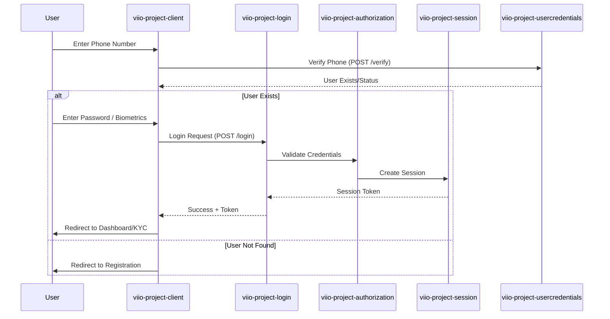

# Authentication & Onboarding Flow

## Scope
This flow manages the user's entry into the Viio application, covering phone verification, password-based login, biometric authentication, and initial session establishment.

## Flow Details
1.  **Entry Point**: The application starts at the `Introduction` or `Login` page.
2.  **Phone Verification**: The user provides their phone number. The client calls the `UserService` to verify if the phone number is registered and if the user's data is up-to-date.
3.  **Authentication**:
    *   **Password**: If registered, the user enters their password.
    *   **Biometrics**: If previously configured and compatible, the user can authenticate using device biometrics (Fingerprint/FaceID).
4.  **Session Management**: Upon successful authentication, a session is established. The `accountSessionManager` handles token storage and session persistence.
5.  **Initial Routing**:
    *   If KYC is pending or rejected, the user is directed to the `KycIntro` page.
    *   If KYC is completed, the user is directed to the `Dashboard`.
    *   If biometric configuration is in progress, the user is prompted to complete it.

## User Experience Showcase
[**Onboarding Video Proof**](https://drive.google.com/drive/folders/1lQ2fNsq6vCTNHcvBGtSB4VLd3-HthPUW?usp=drive_link)
[**Dashboard Video Proof**](https://drive.google.com/drive/folders/1Ozhrlph8tTBHdBbZqcaaKag39hKuU78_?usp=drive_link)

## Interaction Sequence Diagram

