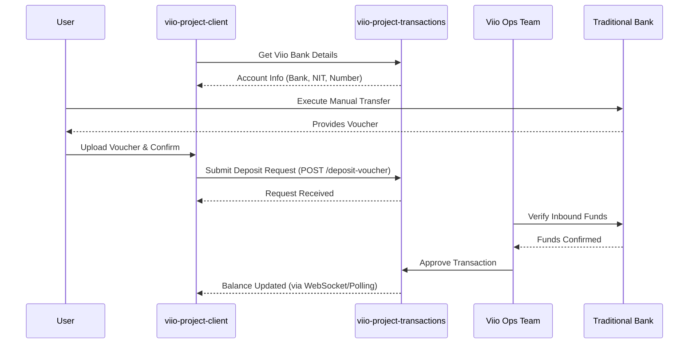

# Bank Transfer Deposit Flow

## Scope
This flow allows users to fund their Viio wallet by making a manual transfer from their traditional bank account to Viio's corporate account. It requires manual verification of the deposit voucher by the Viio operations team.

## Flow Details
1.  **Account Detail Retrieval**:
    *   The user selects "Bank Transfer" as the deposit method. 
    *   The client fetches Viio's official banking details (Bank Name, Account Type, Number, NIT) from the `transactionService`.
2.  **Manual Transfer**:
    *   The user copies these details and performs the transfer from their bank's own application or web portal.
3.  **Voucher Upload**:
    *   The user returns to the Viio app and uploads a screenshot or PDF of the transfer confirmation (Voucher).
    *   This is handled by the `DepositUploadSupportFiles` component.
4.  **Verification & Settlement**:
    *   The transaction request and support file are sent to `viio-project-transactions`.
    *   The Viio operations team verifies the incoming funds in the corporate account. 
    *   Once verified, the transaction status is updated to `COMPLETED`, and the user's balance is synchronized via `viio-project-balance-synchronization`.

## User Experience Showcase
[Video Link Placeholder]

## Interaction Sequence Diagram

