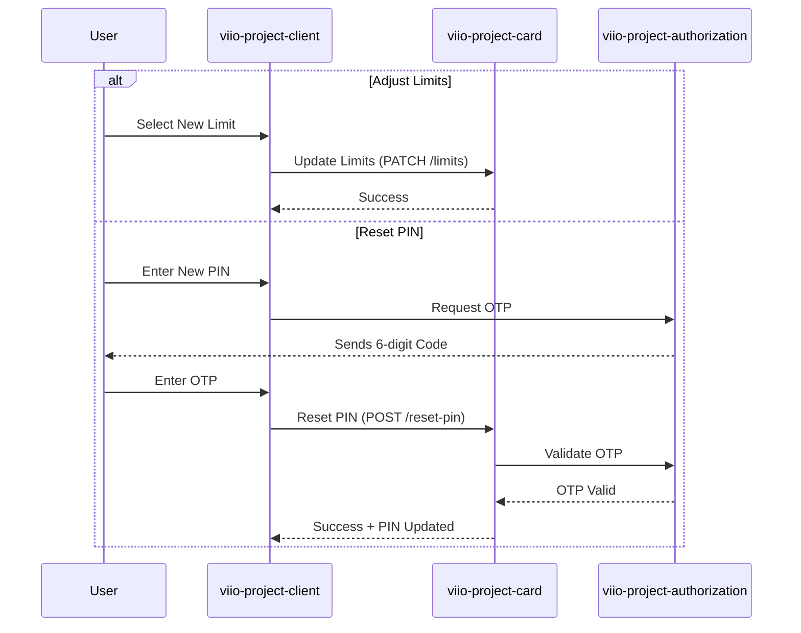

# Card Management Flow (Limits & PIN)

## Scope
This flow provides users with granular control over their Viio cards, allowing them to adjust spending limits for security purposes and manage their card PINs (Change/Reset).

## Flow Details
1.  **Limit Configuration**:
    *   Users can view and modify transaction limits for both virtual and physical cards via `LimitsCardPageLayout`.
    *   Adjustments are relayed to the `viio-project-card` service, which enforces these limits at the processor level.
2.  **PIN Security**:
    *   **Change PIN**: Allows users who know their current PIN to update it directly.
    *   **Reset PIN / Activation**: Used for forgotten PINs or during the initial activation of physical cards. This process is multi-stepped:
        *   The user sets the new 4-digit PIN.
        *   The user must pass an OTP challenge (Email/WhatsApp) to authorize the change.
        *   The `CardManager.resetCardPin` method coordinates the final update with the backend.
3.  **Security Overrides**:
    *   The system can place a card in a `BLOCKED_RESET_PIN` status if anomalous activity is detected, forcing the user through the Reset PIN flow to restore card functionality.

## User Experience Showcase
[Video Link Placeholder]

## Interaction Sequence Diagram

