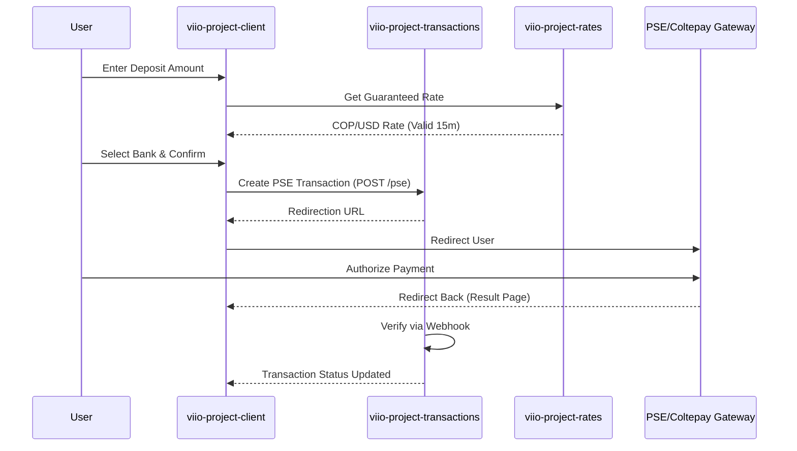

# Deposit (PSE) Flow

## Scope
This flow allows users to fund their Viio wallet using the Colombian PSE (Pagos Seguros en Línea) network. It involves real-time exchange rate calculation, bank selection, and external payment gateway orchestration.

## Flow Details
1.  **Amount & Rate Selection**:
    *   The user specifies the amount in COP (or other supported fiat) they wish to deposit.
    *   The `ratesManager` provides a "Guaranteed Rate" with a 15-minute validity window. If the time expires, the user must refresh the rate.
2.  **Payment Method Selection**:
    *   The user selects PSE. The client fetches the latest list of participating financial institutions via `Coltepay` integration.
3.  **Transaction Initiation**:
    *   The user provides their ID type, number, and selects their bank.
    *   A transaction is created in `viio-project-transactions` with a `PENDING` status.
4.  **External Gateway Redirection**:
    *   The client redirects the user to the secure PSE portal to authorize the payment.
5.  **Return & Verification**:
    *   The user returns to the `DepositTransferResult` page.
    *   The system uses webhooks and polling to verify the transaction status. Once completed, the user's balance is updated via the `balance-synchronization` service.

## User Experience Showcase
[**Deposit PSE Video Proof**](https://drive.google.com/drive/folders/1X9HX9V77TNJCptZpRV5KF_e6kl-2hcsQ?usp=drive_link)

## Interaction Sequence Diagram

