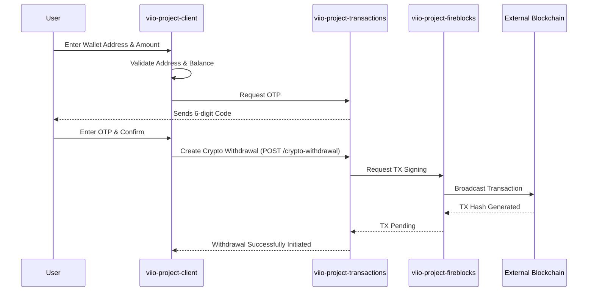

# External Transfer (Crypto Withdrawal) Flow

## Scope
This flow allows users to withdraw their (USDC or USDT) Crypto funds to an external blockchain wallet (e.g., MetaMask, Trust Wallet). It includes network selection, address validation, and secure execution via OTP.

## Flow Details
1.  **Selection & Terms**:
    *   The user selects the crypto asset (typically USDC or USDT) and accepts the terms and conditions related to blockchain transfers (gas fees, irreversible transactions).
2.  **Recipient & Amount Information**:
    *   The user enters the destination wallet address and the amount to send.
    *   The `TransferCryptoForm` validates the address format and checks the user's available balance and `AssetLimits`.
3.  **Security Authorization (OTP)**:
    *   To prevent unauthorized withdrawals, the user must provide a 6-digit OTP sent via WhatsApp or Email.
    *   The `OTPView2` component manages the lifecycle of this security challenge.
4.  **On-Chain Execution**:
    *   The `createExternalWithdrawalTransaction` call in `transactionsManager` sends the request to `viio-project-transactions`.
    *   The backend service interacts with `viio-project-fireblocks` to sign and broadcast the transaction to the blockchain. The user's balance is held in a "Pending" state until the transaction is confirmed on-chain.

## User Experience Showcase
[**External Transfer Video Proof**](https://drive.google.com/drive/folders/1AcpYJbjkt53Oi6eu_9XQ7Fop8o373EpJ?usp=drive_link)

## Interaction Sequence Diagram

