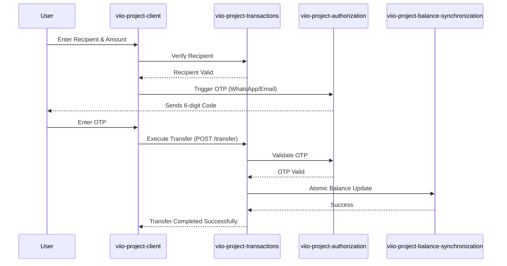

# Internal Transfer Flow (Viio to Viio)

## Scope
This flow enables instant, zero-fee transfers between Viio users. It leverages the internal ledger to move funds between wallets securely, requiring multi-factor authentication for every transaction.

## Flow Details
1.  **Recipient Identification**:
    *   The user identifies the recipient by their registered phone number or email address.
    *   The `TransferViioForm` performs a real-time lookup to ensure the recipient is a valid Viio user and has an active wallet.
2.  **Amount & Compliance**:
    *   The sender specifies the amount. The system checks if the sender has sufficient balance and if the transaction falls within their established `AssetLimits`.
3.  **Security Verification (OTP)**:
    *   Before processing, the user must enter a 6-digit OTP provided via WhatsApp or Email.
    *   The `OTPView2` component handles the delivery and verification of this security code, preventing unauthorized transfers.
4.  **Instant Settlement**:
    *   Once the OTP is verified, the `createTransferBasicTransaction` call triggers an atomic balance update.
    *   The `viio-project-balance-synchronization` service ensures that funds are deducted from the sender and credited to the receiver simultaneously, maintaining ledger integrity.

## User Experience Showcase
[Video Link Placeholder]

## Interaction Sequence Diagram

