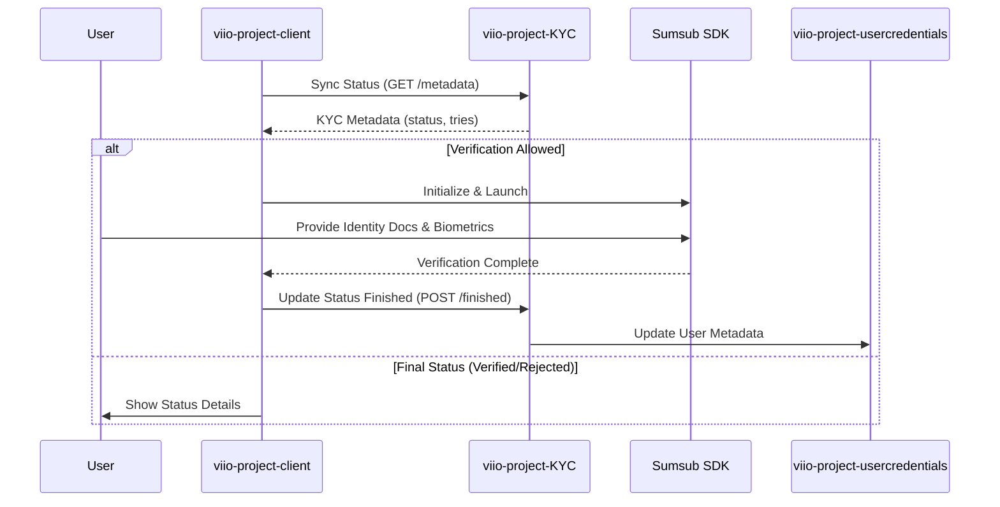

# KYC Verification Flow

## Scope
This flow manages the identity verification process required for users to access advanced features of the Viio application, such as card creation and high-limit transfers.

## Flow Details
1.  **Status Sync**: Upon entering the flow, the `KycManager` synchronizes the current KYC status with the backend service (`viio-project-KYC`).
2.  **Verification Check**: If the system permits verification (e.g., status is `UNKNOWN` or `REJECTED` with remaining attempts), the verification process is initiated.
3.  **SDK Integration**: The client integrates with a 3rd party verification provider (Sumsub). The `useVerification` hook handles the SDK lifecycle:
    *   **Initialization**: Configures the SDK with user-specific tokens.
    *   **Launch**: Opens the verification widget (modal) where the user provides documents and biometrics.
4.  **Completion/Exit**: Once the user completes the flow or exits the widget, the client updates the status via `KycService`:
    *   `updateKycToFinished`: Triggered when the user completes the verification steps.
    *   `updateKycToExitedRequest`: Triggered if the user prematurely closes the verification widget.
5.  **Backend Processing**: The `viio-project-KYC` service receives results from the verification provider (via webhooks or direct polling) and updates the user's compliance status.

## User Experience Showcase
> [!IMPORTANT]
> Due to the sensitive nature of the information contained in the video proof for this flow, access must be requested individually.

## Interaction Sequence Diagram

