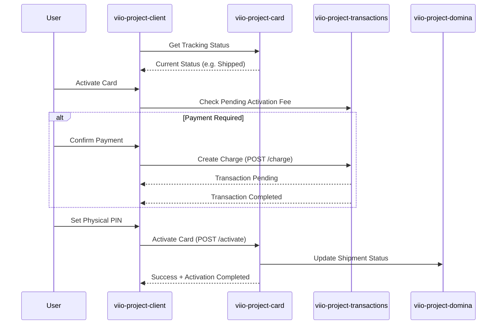

# Physical Card Lifecycle Flow

## Scope
This flow encompasses the tracking of a physical card shipment and the subsequent activation process once the user receives the card. It includes logistics tracking, optional activation fee payment, and PIN configuration.

## Flow Details
1.  **Tracking & Logistics**:
    *   The `CardTrackingManager` synchronizes with backend logistics services to provide real-time updates on the card's shipment status.
    *   Users can view the current stage (e.g., In Production, Shipped, Delivered) in the `CardTrackingPage`.
2.  **Activation Prerequisites**:
    *   Upon starting activation, the system verifies if a fee is required (`validationPayment`).
    *   If a payment is pending, the user initiates a transaction via `transactionsManager.createPhysicalCardCharge`.
    *   The flow remains in a "Payment in Process" state until the transaction is confirmed as `COMPLETED`.
3.  **Secure Activation**:
    *   Once payment (if any) is confirmed, the user is prompted to set a secure 4-digit PIN.
    *   The `activationPhysicalCard` service call transmits the PIN and activates the card in the global processing network.
4.  **Logistics Integration**:
    *   The client interacts with `viio-project-domina` (or equivalent logistics microservice) to manage the physical assignment and shipping details of the card.

## User Experience Showcase
[Video Link Placeholder]

## Interaction Sequence Diagram

