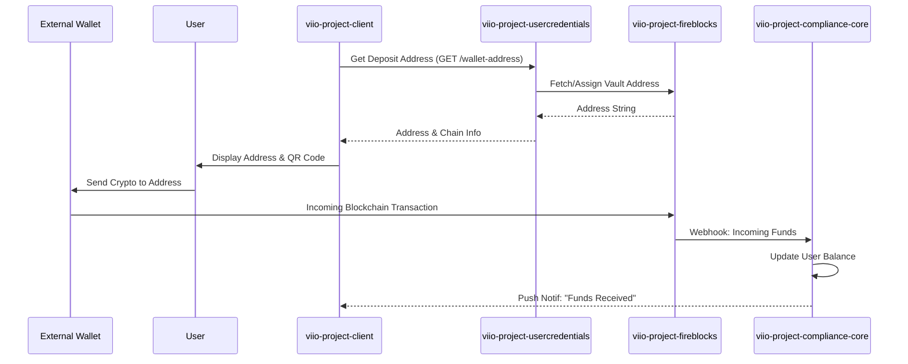

# Receive (Crypto Deposit) Flow

## Scope
This flow allows users to receive USDC, USDT or other crypto assets from external wallets. It provides the user with their unique blockchain address and QR code.

## Flow Details
1.  **Wallet Allocation**:
    *   The client fetches the user's unique deposit address for a specific network (e.g., Polygon, Ethereum) using `userService.getUserWalletAddressFromAsset`.
    *   Addresses are typically managed via Fireblocks.
2.  **Display & Sharing**:
    *   The `ReciverTransfer` component displays the full wallet address and a corresponding QR code.
    *   Users can copy the address to the clipboard or share it via native system dialogs.
3.  **Network Monitoring**:
    *   The user performs the transfer from an external wallet.
    *   Backend listeners (`viio-project-database-listener` or direct Fireblocks webhooks) monitor the blockchain for incoming transactions to the user's address.
4.  **Asynchronous Settlement**:
    *   When an incoming transfer is detected and reaches the required number of confirmations, the `viio-compliance-core` services update the user's balance in real-time. The user is typically notified via push notification.

## User Experience Showcase
[**Receive Crypto Video Proof**](https://drive.google.com/drive/folders/1B-50xBBJ3gURuQwYmjB-2rGu9HBLNIf-?usp=drive_link)

## Interaction Sequence Diagram

