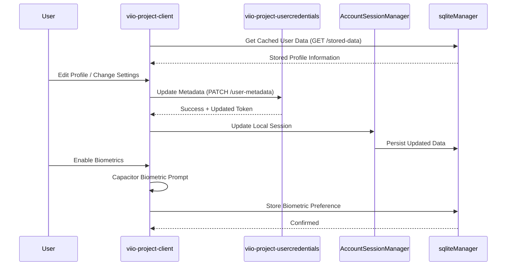

# User Profile & Settings

## Scope
This flow manages the user's identity data, security preferences, and account configurations. It ensures that personal information is kept up to date and that the user has control over their session security.

## Flow Details
1.  **Identity Management**:
    *   Users can view their registered data (Email, Phone, Name) managed by the `UserService`.
2.  **Security Prefs**:
    *   Configuration of Biometric login (FaceID/Fingerprint) and session timeout settings.
3.  **Support & Legal**:
    *   Direct access to help center and terms of service.

## Interaction Sequence Diagram

## User Experience Showcase
[**User Profile Video Proof**](https://drive.google.com/drive/folders/1jnqZZV_ztyHFmv81iz2EzOFjoznwqDh8?usp=drive_link)
[**Onboarding Video Proof**](https://drive.google.com/drive/folders/1lQ2fNsq6vCTNHcvBGtSB4VLd3-HthPUW?usp=drive_link)