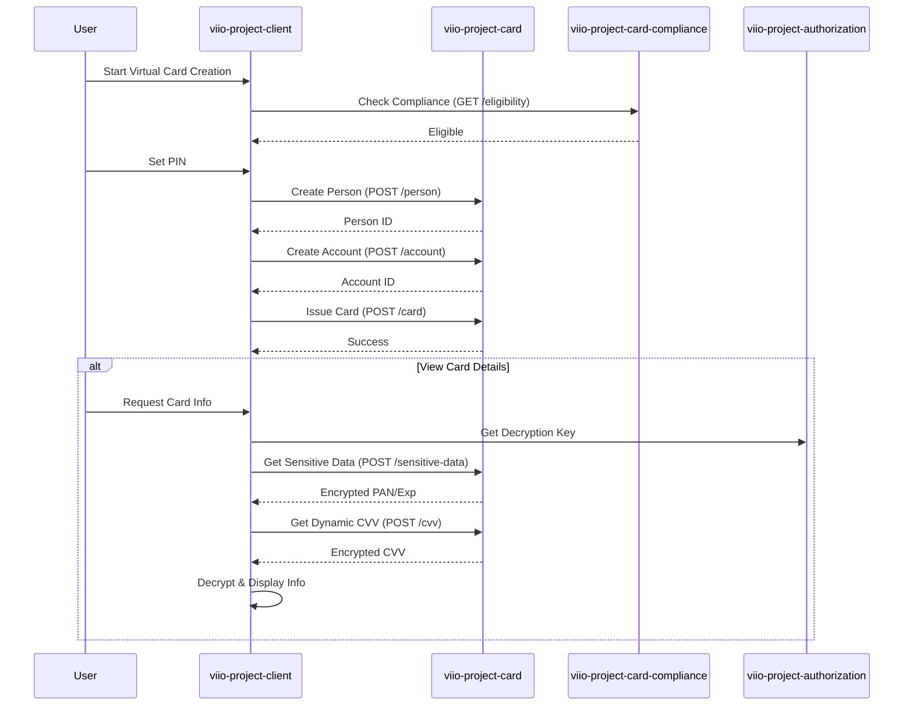

# Virtual Card Creation Flow

## Scope
This flow allows verified users to issue a virtual Mastercard for international online payments. It includes identity registration with the card processor, account creation, and card issuance.

## Flow Details
1.  **Eligibility Check**: Before starting, the `CardManager` verifies the user's KYC status and checks for existing virtual card products to prevent duplicate issuance.
2.  **Process Initiation**: The `CarrouselVirtualCardProcessSwiper` guides the user through the benefits and terms of the virtual card.
3.  **PIN Setup**: The user sets a 4-digit security PIN for the card.
4.  **Issuance Orchestration**: The `registerAccountAndIssueCard` method in `CardManager` coordinates the following steps:
    *   **Person Registration**: Creates the user's profile in the card processor system (`createPersonCardService`).
    *   **Account Creation**: Registers a financial account associated with the card (`createdAccountCardService`).
    *   **Card Issuance**: Officially issues the virtual card with the set PIN (`createCardService`).
5.  **Sensitive Data Retrieval**: To view the PAN, CVV, and Expiration Date, the client uses a secure mechanism:
    *   `sensitivityCardData`: Retrieves encrypted card details.
    *   `getDynamicCvv`: Retrieves a time-limited dynamic CVV, decrypted client-side using a key derived from the `cipherManager`.

## User Experience Showcase
> [!IMPORTANT]
> Due to the sensitive nature of the information contained in the video proof for this flow, access must be requested individually.

## Interaction Sequence Diagram

