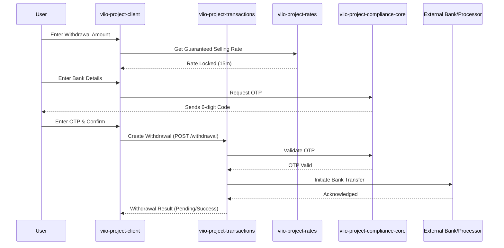

# Withdrawal Flow (Bank Transfer)

## Scope
This flow allows users to exit funds from their Viio wallet to external financial institutions. It supports multi-currency conversion and requires robust authentication via OTP to ensure fund security.

## Flow Details
1.  **Selection & Rate Lock**:
    *   The user specifies the amount to withdraw and the target currency (e.g., COP for Colombian bank accounts).
    *   Similar to the deposit flow, a "Guaranteed Rate" is provided by the `ratesManager`. This rate is locked for a short period to protect the user from market volatility.
2.  **External Account Configuration**:
    *   The user selects their bank from a list provided by the payment processor (Coltepay bank list) and enters their account details (Account Type, Number, ID).
    *   The `WithdrawalCurrencyForm` captures and validates these details before proceeding.
3.  **Security Challenge (OTP)**:
    *   All withdrawals require explicit authorization. The user receives a 6-digit OTP via their chosen channel (WhatsApp or Email).
    *   The `OTPView2` validates the code before the client submits the final withdrawal request.
4.  **Transaction Orchestration**:
    *   The `createWithdrawal` service call sends the validated payload and OTP to `viio-project-transactions`.
    *   The backend service coordinates with external banking gateways to initiate the transfer. The transaction status transitions from `PENDING` to `COMPLETED` once the funds are processed by the external bank.

## User Experience Showcase
[**Withdrawal Video Proof**](https://drive.google.com/drive/folders/1bYelBeT3yAa2AYzbJfg0yTyi58MyFb5w?usp=drive_link)

## Interaction Sequence Diagram

